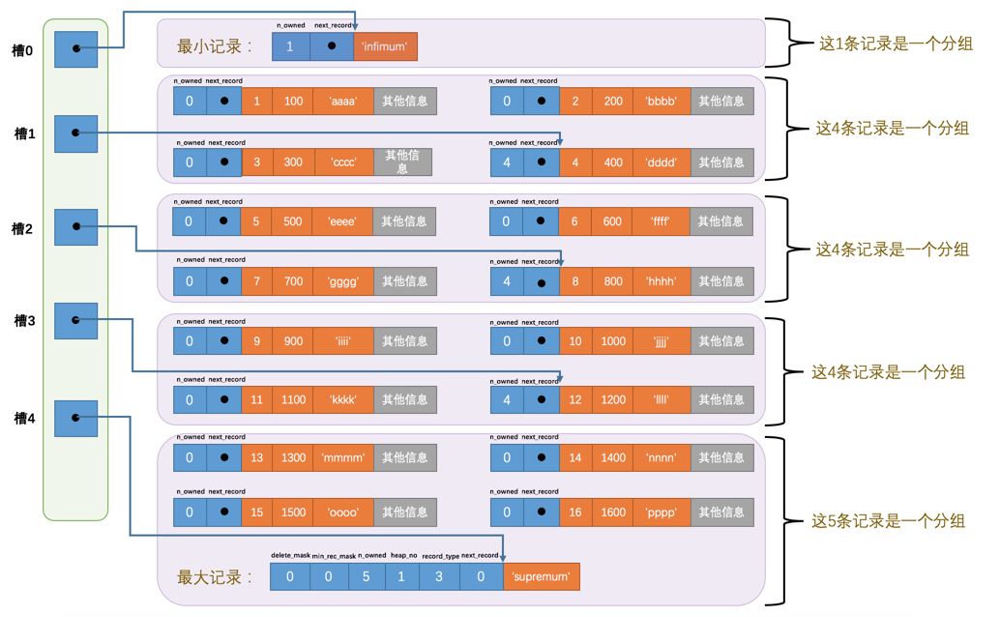

# 前言 

以下是吐槽，可以跳过~~

在本科大二阶段学完数据库之后，大概有俩年的时间都没有再认真的深入的学习。再次看到数据库的知识都已经是面试题了，虽然写过了无数次的增删查改和各种连接，但是看到面试问的这些内容我是一个不会啊😭

我不禁又把责任抛给别人，我的本科教育都TM教了什么啊😣

想起了暑假看的[上交大生存指南](https://survivesjtu.gitbook.io/survivesjtumanual/)，为什么08年写的小册子，我23年才看到。果然人与人的差距比人与狗都大...

---

**吐槽完毕**，我首先要说一下我都看了哪些优秀的博文。

**《MySQL是怎样运行的》- 小孩子4919**：这本书可以说是我的`MySQL`启蒙书，作者用深入浅出的话从`MySQL`的行结构到索引到事务全部白话了一遍，看这本书就像看小说一样爽。绝对值得放在第一位推荐。再次感谢大佬的书，拯救了我这个本科教育漏网之鱼。❤️

**《MySQL实战45讲》- 林晓斌/”丁奇“**：阿里的`MySQL`内核开发大佬，我一直都很喜欢极客时间里面大佬写的文章。

> **我们都是小青蛙** 这个是获取《MySQL是怎样运行的》的资料的微信公众号, 是小孩子自己的官方账号.

___

**我十分建议你先不要读我的文章, 直接去看小孩子写的书, 我的文章是我自己对小孩子书籍的一种翻译过程, 他掺杂了我自己的理解, 可能也会忽略掉小孩子想表达的重点, 如果你执意要看我写的文章, 那么我希望你先看一下我的文章结构.**

我要简介一下我的文章结构, 以方便您快速定位本文是否适合你或者找到自己想要的知识.

我将MySQL分为四个大的模块,

- 存储
- 查询
- 优化
- 事务

好了, 我们开始了!

# 1. 存储

## 1.1 从一行记录开始

我们在搞清楚`MySQL`是怎么做到查询, 事务等等一系列事情的时候, 我们不得不先从他的物理存储说起. 所谓的先有数据结构的设计, 然后才有各种操作和算法.

### Compact

我们直接观察`MySQL`如何进行一行数据的存储:


- 使用变长字段列表来存储那些会进行动态变化的字段, 而不是为这些变长字段预分配空间, 这是`MySQL`大叔为了节省空间的做法.
- 溢出页的处理, 如果一个变长字段增长的很大, 导致一页不够放了, 我们就需要将没有放入的数据存放到其他的页面中, 这就是页面分裂, 我们会在本页中存储一部分数据, 其他的数据单独存放在一个页面当中

- 使用 `NULL` 值列表进行 `NULL` 的存储, 每一个 `bit` 代表一个字段是否是 `NULL`， 不存储那些不允许为 `NULL` 的字段，`1` 代表是`NULL`

- 记录头信息有其他的作用, 我们暂时不用看

到现在为止, 你已经简单了解了 `MySQL` 的行存储格式，看上去好像也没有特别牛逼的东西啊。

>辟谣: 有许多的博客都是正气凛然的告诉你, CHAR类型是定长数组, 所以不会造成页面分裂, 但是在MySQL的设计中, 如果字符集是变长字符集, 那么CHAR类型会被存储到变长字段列表中, 所以有可能造成页面分裂

### Redundant

其实MySQL大叔不仅仅设计了这一种格式, 还有其他的三种, 不过和这个格式大同小异


这种格式和COMPACT行格式的区别:

- 没有变长字段长度列表, 使用字段长度偏移列表进行代替
- 没有NULL值列表, 使用字段偏移列表的首个bit位表示
- 使用预分配的方式存储CHAR类型的数据, 例如CHAR(10)字符集是utf8mb4的字段分配40 byte

### DYNAMIC和COMPRESSED行格式

这俩中行格式基于COMPACT行格式

区别: 

- DYNAMIC在处理溢出的时候, 直接将所有的数据放入溢出页
- COMPRESSED基于DYNAMIC增加了压缩处理

## 1.2 页结构

一个页面结构大致可以划分为7个部分：


记录在页面中的存放如图所示，有一个页目录用于二分查找，每个记录使用单链表的方式进行由主键从小到大的方式进行连接。因此在一个页中通过主键查找一条记录是非常快的。

1. 通过二分查找法，确定一个记录所在的组
2. 通过单链表，遍历这个组的各个记录



各个页面之间使用双向链表进行连接，将页从内存刷新到磁盘的时候，为了保证页面的完整性，在页面首部和页面尾部会存储页面的校验和以及页面最后修改的LSN。

页面的存储示意图如下：


## 1.3 数据目录

表在文件系统中使用下面方式进行表示：

- 表结构的定义
- 表中的数据

## 1.4 表空间

区：64个连续的页就是一个区，一个区就是1MB大小，引入区的目的就是尽量消除随机IO，使用顺序IO

组：256个连续的区就是一个组，一个组就是256MB大小

段：段是一个逻辑概念，一个索引会生成俩个段：叶子节点段和非叶子节点段

独立表空间和系统表空间的区别：系统表空间多了一些控制信息

## 1.5 InnoDB统计数据的收集

这一章过于底层，记住收集的数据可以永久的存储的磁盘上，也可以只存储在内存中就可以了。

## 1.6 Buffer Pool

### Buffer Pool 的作用

将整个页加载到内存中后就可以进行读写访问了，在进行完读写访问之后并不着急把该页对应的内存空间释放掉，而是将其缓存起来，这样将来有请求再次访问该页面时，就可以省去 <font color = "red">磁盘 IO </font> 的开销了。

### Buffer Pool 设计的关键问题

- 缓存和磁盘之间数据的一致性问题

在进行数据更新的时候首先查看 Buffer Pool 中是否有数据页面。为了快速的查看缓存中是否有数据页面

使用哈希表 `表空间号 + 页号: 控制块` 的方式保存一份信息。

- 缓存的内存淘汰策略

	- 从 LRU 链表中的冷数据中刷新一部分页面到磁盘当中，从而释放一部分页面

	- 从 flush 链表当中刷新一部分页面到磁盘当中。

- 如何提高缓存的命中率
- 预读问题导致的频繁淘汰问题

第一次进入缓存的数据页放在 old 区域。

- 全表扫描导致的无用数据进入缓存问题

访问时间距离第一次很近不进行数据页面的移动。

- 提高 Buffer Pool 的并发访问能力

### Buffer Pool 的设计

**Buffer Pool 的组成：**


**free 链表：**

把所有空闲的缓存页对应的控制块作为一个节点放到一个链表中


**flush 链表：**

一个存储脏页的链表，凡是修改过的缓存页对应的控制块都会作为一个节点加入到一个链表中


**区域划分：**

减轻因为节点频繁移动而造成的性能开销。


**多个实例：**

提高 Buffer Pool 的并发访问能力


### Buffer Pool 的配置

Buffer Pool 的大小默认为 128 MB，最小为 5 MB

查看 Buffer Pool 的信息

```
 SHOW ENGINE INNODB STATUS
```

# 2. 查询

查询操作时MySQL的基本操作, 查询主要分为单表查询和多表查询, 分别来介绍这俩种查询方式.

## 2.1 单表查询

`MySQL`中执行查询语句的方式成为**访问方法**.

- const: 通过主键或者唯一二级索引做等值比较  ===> 会定位到一条记录
- ref: 普通二级索引做等值比较 ===> 可能会返回多条记录
- range: 通过索引列做范围查询 ===> 返回多条记录
- index: 直接扫描二级索引就可以得出的方法 ===> 扫描全部的二级索引
- all: 全表扫描聚簇索引

在特定条件下会利用索引合并完成查询, 用来减少回表:

1. Intersection 索引合并

    - **条件: **可以利用俩个二级索引 + 索引按照主键排序

    先分别查询出二级索引, 取俩个二级索引的交集, 然后再进行回表操作

2. Union 索引合并

    - **条件: **可以利用俩个二级索引 + 索引按照主键排序

    先分别查询出二级索引, 取俩个二级索引的并集, 然后进行回表操作

3. Sort - Union 索引合并

    先分别查询出二级索引, 排序二级索引, 然后取俩个二级索引的交集, 进行回表操作

## 2.2 多表查询

**连接的简单介绍:**

1. 笛卡尔集: m * n
2. 内连接: 在被驱动表中找不到的记录, 不放入结果集
3. 外连接: 在被驱动表中找不到的记录, 放入结果集并记录为NULL

**连接的原理:**

1. 嵌套循环连接: 依次查询出驱动表中的每一条记录, 然后查询被驱动表, 时间复杂度 O(n * m)
2. 基于块的循环连接: 将驱动表的结果集放入内存中, 每次被驱动表和多个驱动表的结果集做匹配, 减少被驱动表在内存和磁盘中换入换出的IO消耗

>在得到驱动表的记录之后, 访问被驱动表就可以使用单表访问方法进行优化了

# 3. 优化

`MySQL`的优化基于俩种形式, 我感觉是俩种派别

1. **行动派 - 基于成本的优化:** 直接算出每一种查询方式查询的成本, 然后对比各种成本, 选择出一种最优的结果
2. **理论派 - 基于规则的优化: ** 在没有实际查询之前, 先看看有没有优化的空间, 比如常量简化, 连接转化什么的

由于我们查询涉及到俩种类型, 所以优化也有俩种类型

1. **单表优化**
2. **多表优化**

于是我们一共有`2 x 2 = 4`四种情况需要讨论.

在讨论完优化之后, 我们要讨论一下, 我们怎么使用`MySQL`的命令去查看我们的每一条`SQL`是怎么执行的.

这大概就是本章会讨论的内容.

## 3.1 基于成本的优化

**成本 = CPU + IO**

### 3.1.1 单表优化

1. 根据搜索条件, 找出可能使用到的索引
2. 计算全表扫描的代价
3. 计算使用不同索引的查询代价
4. 对比各种方案


那么不同的成本主要分为全表扫描的成本和使用索引的成本, 我们下面分别来分析**这俩种情况的成本**:

1. 全表扫描的成本:

    - CPU成本: 根据全表记录的数目决定
    - IO成本: 所有的记录一共占用了多少个页面决定

2. 索引查询成本:

    **第一阶段:** 确定搜索空间 - 二级索引

    - CPU成本: 根据二级索引的数目决定 (在二级索引条目比较多的情况下, 我们使用的是一个估计值)
    - IO成本: 粗暴地认为, 一个扫描空间的代价和一个页面的代价一样

    **第二阶段:** 回表阶段

    - CPU成本: 二级索引数目决定
    - IO成本: 二级索引数目决定

> 1. 二级索引的条目估计方法
>
> 计算出二级索引占用几个页面, 估计出前10个页面的平均索引数目, 估算二级索引数目
>
> 2. Index Dive的简介
>
> 在索引扫描区间比较多的时候, 可能还不如全表扫描的效率好, 所以`MySQL`规定当索引扫描区间大于`eq_range_index_dive_limit`的时候, 就不使用索引进行查询

### 3.1.2 多表优化

多表查询主要指的是内连接和外连接.

**查询成本 = 驱动表查询成本 + 扇出数目 * 被驱动表查询成本**

- 对于外连接, 驱动表和被驱动表是确定的, 所以只需要为驱动表和被驱动表选择成本最低的访问方法, 然后就可以得到最优的解决方案.

- 对于内连接, 可以交换驱动表和被驱动表确定最小的查询成本

- 对于多表内连接, 通过维护一个全局的已知最小成本进行剪枝

## 3.2 基于规则的优化

基于规则的优化主要有三种:

- 条件简化
- 外连接消除
- 子查询优化

由于我没有找到一个合适的分类方法, 所以我还是按照单表多表的方式, 这样看起来前后是一致的.


### 3.2.1 单表优化

单表优化的方式主要是条件简化

- 移除不必要的括号
- 常量传递
- 移除没用的条件
- 表达式计算
- 在没有group by和聚合函数的情况下, 将having和where子句合并起来

### 3.2.2 多表优化

**外连接转为内连接**

在被驱动表中有空值拒绝的条件的时候, 外连接和内连接没有区别, 可以考虑使用内连接的方法进行更换驱动表进行优化.

****

**子查询优化**

先讲讲子查询分类:

1. 按照结果集分类:
    - 标量子查询
    - 行子查询
    - 列子查询
    - 表子查询
2. 按照相关性查询
    - 不相关子查询
    - 相关子查询

> 子查询必须用小括号括起来
>
> Select的子句中的子查询必须要是标量子查询
>
> 对于表子查询, 需要使用Limit来限制记录的数量

**再讲讲子查询的执行方式, 不同的查询导致子查询的执行方式也是不一样的.由于我们还需要按照相关和不相关进行分类, 所以这里的情况还是挺多的**

1. 标量子查询, 行子查询

    - 不相关子查询
        - 首先执行子查询语句
        - 然后将查询到的结果当作外层查询的参数
        - 再执行外层查询

    - 相关子查询
        - 从外层查询中获取一条记录
        - 从这条记录中获取子查询中设计的值, 执行子查询
        - 用子查询的结果来检测外层查询的WHERE子句条件是否成立

2. IN子查询

将子查询进行物化，将表和物化表进行连接，（准确来讲是半连接，因为这个连接只关心是否存在由记录满足条件，根本不关心有多少条记录复合条件），**为什么要费劲巴拉的转化为连接，主要想用索引！**

## 3.3 EXPLAIN

终于说完了优化的模块, 下面来说一下EXPLAIN

EXPLAIN输出有很多列, 我们详细解释一下这些列的作用之后, 就算完成了EXPLAIN的解释.


重要属性解释:

**select_type**

表明了这个SELECT在一个查询中的角色.

- SIMPLE: 不包含子查询和UNION的查询都算SIMPLE的类型
- PRIMARY: 对于包含UNION和子查询的查询语句来说, 最左边的就是PRIMARY
- UNION: UNION中除了最左边的查询
- UNION_RESULT: 使用临时表进行去重等操作
- SUBQUERY: 不相关子查询的物化形式
- DEPENDENT SUBQUERY: 相关子查询
- DERIVED: 派生表的方式执行查询
- MATERIALIZED: 物化表的查询

**type**

表明了这个查询的访问方法

- const: 主键或者唯一二级索引等值查询
- eq_ref: 被驱动表是通过主键或者唯一二级索引方式进行访问的
- ref: 当通过普通的二级索引列和常量进行等值匹配的方式查询某一个表的时候
- index_merger: 索引合并的方式进行的查询
- range: 利用索引获得查询区间的查询
- index: 索引覆盖查询
- all: 全表扫描

**possible_keys 和 key**

可能使用的索引和实际使用的索引

**key_len**

索引的长度 

**ref**

表示与索引列进行等值匹配的对象是什么

**rows**

表示聚簇索引的行数或者索引的行数

**filtered**

表示条件过滤之后还有多少条数据需要扇出

**EXTRA**

这个里面有太多属性了, 不进行一一解释, 需要用到可以直接进行搜索

**JSON的执行计划**

可以使用这种格式来查看某个执行计划花费的成本.

## 3.4 更详细的优化和执行计划 - optimizer trace

optimizer输出的确实太多了, 这里只简单介绍他的存储位置和怎么开启, 如果有深入进行SQL优化的需求, 还需要再进行深入的了解

1. 打开optimizer trace功能 : 设置 `optimizer_trace`为on
2. 查询语句的优化在`information_schema`的`OPTIMIZER_TRACE`中

优化主要分为三个阶段:

- prepare阶段
- optimizer阶段
- execute阶段

# 4. 事务

事务的四个原则：

- 原子性
- 隔离性
- 持久性
- 一致性

原子性，隔离性和持久性都是为了保证一致性

事务的语法：

1. 开启事务

```
<begin>/<start transaction> [ready only]/[read write] [with consistent snapshot]
```

2. 提交事务

```
commit
```

3. 中止事务

```
rollback
```

4. 隐式提交事务的情况

- 使用DDL语言
- 隐式使用或者修改mysql数据库中的表
- 使用事务控制的语句，比如新开了一个事务，会自动提交上一个事务

事务的几种状态：

- 活动的
- 部分提交的
- 失败的
- 中止的
- 提交的

## 持久性的实现

要想实现持久性，就要保证说过的话一定能做到，没说完的话可以后悔

1. redo log 用来实现说过的话一定做到


## 隔离性

多个不同的事务并发执行可能会导致不一致性的出现。

那么如果串行化执行

